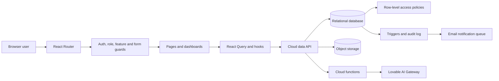
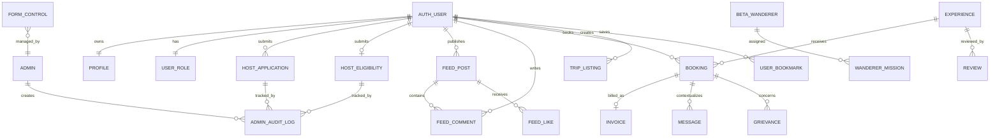
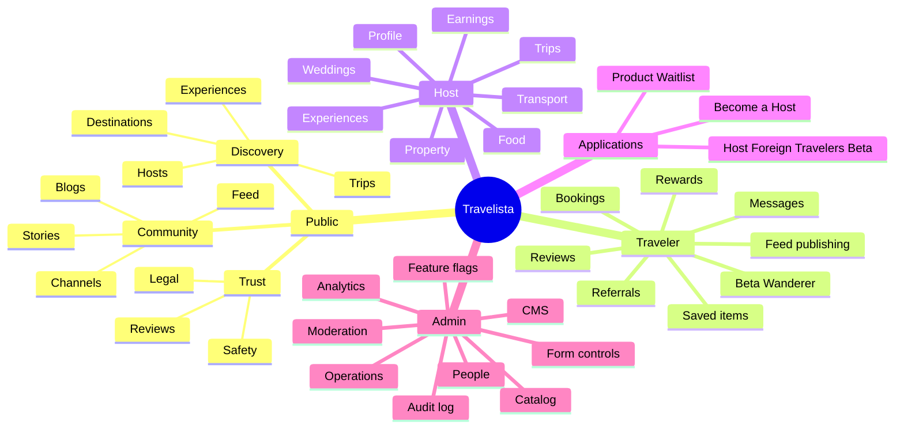

# Travelista Platform Documentation

**Version:** 2.0  
**Updated:** 7 August 2026  
**Purpose:** Product, route, form, role, architecture, and operations reference.

## 1. Platform overview

Travelista is an India-focused social travel marketplace. It combines destination discovery, local-host services, traveler-led trips, community publishing, bookings, trust and safety, rewards, beta creator programs, and an administration console.

### User types

| User type | Purpose | Primary workspace |
|---|---|---|
| Public visitor | Discover destinations, experiences, trips, stories, hosts, and plans | Public website |
| Traveler | Book, publish stories, join trips, message hosts, review, save, earn rewards | `/dashboard/traveler` |
| Host | Maintain a host profile, services, listings, trips, bookings, and earnings | `/dashboard/host` |
| Host applicant | Submit the standard host registration and track review status | `/become-host` |
| Global-host beta applicant | Apply to the separate Host Foreign Travelers beta program | `/host-eligibility` |
| Beta Wanderer | Complete creator missions and participate in creator rankings | `/beta-wanderers` |
| Administrator | Operate users, applications, catalog, moderation, CMS, configuration, analytics, and audit history | `/dashboard/admin` |

> A host account and traveler account are separate roles. The application enforces role-aware sign-in portals and dashboard guards.

## 2. URL and route catalog

### Public discovery and content

| Route | Description | Access |
|---|---|---|
| `/` | Main Travelista discovery page | Public |
| `/explore` | Unified exploration view | Public |
| `/experiences` | Search and browse approved experiences | Public |
| `/experience/:id` | Experience details, host, media, pricing, reviews, and booking CTA | Public |
| `/destinations` | Browse India destinations | Public |
| `/destination/:name` | Destination guide, local hosts, reviews, and experiences | Public |
| `/trips` | Browse traveler-led group trips | Public |
| `/trip/:id` | Trip details and participation information | Public |
| `/trip-leader/:id` | Public trip-leader profile | Public |
| `/host/:id` | Public host profile and offerings | Public |
| `/traveler/:id` | Public traveler profile with posts, trips, and reviews | Public |
| `/feed` | Traveler story feed with media, tags, likes, comments, and bookmarks | Public read; sign-in for actions |
| `/community` | Traveler stories and community channels | Public |
| `/resources` | Travel resources index | Public |
| `/resource/:slug` | Individual travel guide | Public |
| `/blog/:id` | CMS-managed blog article | Public |
| `/bike-tours` | Bike-tour feature page | Public |
| `/features` | Platform feature hub | Public |
| `/leaderboard` | Community and creator rankings | Public |
| `/rewards` | Travel streaks and achievement hub | Public preview; account actions gated |
| `/membership` | Subscription tiers and benefits | Public |
| `/referrals` | Referral program | Signed-in actions |

### Authentication and accounts

| Route | Description | Form control |
|---|---|---|
| `/signup` | Traveler account registration with preferences | `account_signup` |
| `/login/traveler` | Traveler-only sign in | `traveler_login` |
| `/login/host` | Host-only sign in | `host_login` |
| `/admin-login` | Administrator-only sign in | `admin_login` |
| `/forgot-password` | Request a secure password reset email | `password_recovery` |
| `/reset-password` | Set a new password from a recovery link | Always available to valid recovery links |
| `/auth/callback` | Social sign-in callback and role-aware routing | System |

### Applications, forms, and transactions

| Route | Description | Program / control |
|---|---|---|
| `/become-host` | Standard host registration: personal details, services, stay, transport, food, photos, pricing | Standard; `become_host` |
| `/host-eligibility` | Separate Host Foreign Travelers beta: KYC signals, languages, experience, social proof, score, credibility quiz | Beta; feature flag + `host_eligibility_beta` |
| `/beta-wanderer-apply` | Creator/Beta Wanderer application | `beta_wanderer` |
| `/beta-wanderers` | Approved Beta Wanderer directory | Public |
| `/beta-wanderer/:id` | Beta Wanderer profile | Public |
| `/beta-waitlist` | Product beta waitlist form | `beta_waitlist` |
| `/beta-waitlist/confirm` | Confirm beta waitlist email token | Public token route |
| `/book/:id` | Experience booking form and price calculation | Traveler; `booking` |
| `/host-trip` | Create a trip listing | Host; `host_trip` |
| `/grievances` | Submit and track a support or dispute ticket | Signed in; `grievance` |
| `/help` | Help center and chat entry point | Public |

### Protected dashboards

| Route | Description | Guard |
|---|---|---|
| `/dashboard/traveler` | Traveler profile, saved items, bookings, invoices, messages, reviews, rewards, and settings | Traveler role |
| `/dashboard/host` | Host profile, services, listings, bookings, messages, earnings, payout history, and settings | Host role |
| `/dashboard/admin` | Complete operations console | Admin role |

### Standalone administration routes

| Route | Description |
|---|---|
| `/admin/feature-flags` | Global and user-specific feature rollout controls |
| `/admin/waitlist` | Product beta waitlist review and outreach |
| `/admin/audit-log` | Administrative action history |
| `/admin/performance` | Client route timings, resources, bundles, and slow-request diagnostics |

### Legal and documentation

| Route | Description |
|---|---|
| `/safety` | Trust and safety guidance |
| `/terms` | Terms of service |
| `/privacy` | Privacy policy |
| `/cookies` | Cookie policy |
| `/docs` | In-app developer and platform documentation |
| `*` | Branded not-found page |

## 3. Form catalog and utility

Administrators manage form availability in **Admin → Configuration → Form availability**. A disabled form displays a maintenance state and rejects access to its UI. Beta availability and form availability are independent controls.

| Form | Inputs / utility | Data destination | Result |
|---|---|---|---|
| Account sign-up | Name, email, password, phone, nationality, travel styles, interests, terms | Auth, `profiles`, `user_roles` | Verification email; traveler account |
| Traveler / Host sign-in | Email and password; Google sign-in | Auth | Role checked before dashboard redirect |
| Password recovery | Email, recovery token, new password | Auth | Default verification/reset email and password update |
| Become a Host | Identity/contact, city/state, languages, services, bio, specialties, pricing, stay/transport/food details, photos | `host_applications` | Receipt notification; admin review; status notifications; host activation on approval |
| Host Foreign Travelers beta | Contact, countries, languages, proficiency, hosting record, KYC/passport signals, references, specialties, motivation, social links, credibility quiz | `host_eligibility` | Scoring, waitlist/review state, beta approval notification |
| Beta Wanderer | Creator profile and program information | `beta_wanderers` | Admin moderation and missions |
| Product beta waitlist | Email, name, city, interest, plan, source | `beta_waitlist` | Confirmation token and confirmation email record |
| Booking | Dates, guests, services/add-ons, message, calculated total | `bookings` | Pending booking for host response |
| Host trip | Trip format, route/destination, dates, capacity, price model, inclusions, image | `trip_listings` | Published/pending trip listing |
| Traveler feed post | Media, caption, tag type/value, location | `feed_posts`, `feed-media` | Social post subject to moderation |
| Feed comment | Post and bounded plain text | `feed_comments` | Comment thread update |
| Review | Rating, text, optional video and target | `reviews` | Traveler-only review record |
| Grievance | Category, subject, description, target/booking | `grievances` | Admin support queue |
| CMS content | Rich title/body, taxonomy, author, location, media, publish settings | CMS tables | Blog/story/tip/channel content |

## 4. Features by user

### Public visitor

- Browse destinations, experiences, trips, hosts, traveler profiles, community stories, blogs, guides, memberships, and rankings.
- Use the AI Travel Guide when enabled.
- Read public reviews and inspect local-host recommendations.
- Share destination, trip, profile, and content links with metadata.
- Apply to public programs when the relevant form and feature switch are enabled.

### Traveler

- Dedicated traveler sign-in and guarded dashboard.
- Manage profile, avatar, social links, password, and preferences.
- Search, bookmark, and book experiences.
- Save posts, trips, and experiences.
- Publish feed stories; like and comment on posts.
- Join group trips, contact hosts, submit eligible reviews, raise grievances.
- Access invoices, messages, referral tools, streak rewards, and subscription benefits.
- Apply for Beta Wanderer and other traveler programs.

### Host

- Dedicated host sign-in and guarded dashboard.
- Manage public host profile, avatar, social links, and services.
- Create experiences, stays, dishes, transport offerings, special requests, trips, and wedding events.
- Manage bookings and traveler communication.
- View gross booking value, platform commission, net payout, and booking-linked earning history.
- Respond to operational status changes and support cases.

### Host applicant

- Submit standard host registration independently of the beta program.
- Receive submission and status-update notification records.
- Admin approval sets the application to approved, records an audit event, and activates the host role for linked accounts.
- Anonymous applications can be reviewed, but account activation requires a linked signed-in user.

### Host Foreign Travelers beta applicant

- Enter a selective, scored beta program independently from standard host onboarding.
- Provide international-hosting signals, KYC readiness, social proof, and credibility-quiz answers.
- Receive waitlist/review/approval status updates.
- Admins can open or close the beta using both a feature flag and form switch.

### Beta Wanderer

- Creator profile, missions, score, badges, and leaderboard participation.
- Program access can be combined with subscription eligibility rules.

### Administrator

- Live overview, analytics, platform health, and performance profiling.
- User management: roles, permissions, communication, chat, and bans.
- Review standard host applications and separate global-host beta applications.
- Review Beta Wanderers, missions, leaderboard, trips, weddings, bookings, invoices, and grievances.
- Catalog CRUD for destinations, experiences, plans, and CMS content.
- Feed and review moderation with pagination.
- Form controls, feature flags, test-mode versions, runtime configuration, and website CMS.
- Audit trails for administrative changes and application status history.

## 5. Host application lifecycle

### Standard Become a Host

1. Applicant opens `/become-host`.
2. The frontend validates required identity, contact, service, description, and pricing fields.
3. A row is created in `host_applications` with `pending` status.
4. A submission notification record is queued.
5. Admin reviews the full application under **People → Host Waitlist → Host profile applications**.
6. Review, verification, rejection, and approval changes update status and create audit entries.
7. Approval calls the protected approval operation; a linked account receives the `host` role.
8. The applicant receives a status-update notification record.

### Host Foreign Travelers beta

1. The global beta feature flag and form switch must both be enabled.
2. A signed-in host applicant opens `/host-eligibility`.
3. Validation, eligibility scoring, social scoring, badge calculation, and initial queue placement run.
4. The applicant may complete the credibility quiz for an additional score.
5. Admin reviews the application in the separate Host Foreign Travelers table.
6. Status changes are audited and generate applicant notification records.
7. Approval activates the host role and moves the account into active People/Hosts views.

## 6. Technical architecture

### Frontend

- React 18, TypeScript, Vite, React Router, Tailwind CSS, shadcn/Radix UI.
- React Query provides cached data access and controlled refetch behavior.
- Auth and currency are provided through application contexts.
- Route-level lazy loading limits the initial JavaScript payload.
- Zod validates user-controlled form input; uploads are resized/compressed to WebP.

### Backend

- Lovable Cloud provides relational data, authentication, row-level access rules, storage, real-time messaging, and functions.
- `profiles` contains public/user profile data; `user_roles` is the sole role authority.
- Row-level policies separate owner, public, host, and admin access.
- Protected database operations perform atomic approval, role activation, and audit logging.
- Storage buckets separate avatars, experiences, feed media, and trip images.

### Data and request flow

## 7. Relationship diagram

## 8. Feature mind map

## 9. Security and validation guidelines

- Never infer roles from browser storage or profile fields; use `user_roles` and backend checks.
- Keep traveler and host login routes separate and reject cross-role portal sign-in.
- Validate all form fields client-side and enforce ownership/status constraints in backend policies.
- Do not render user-provided HTML. CMS rich text must remain sanitized.
- Scope storage writes to the authenticated user’s folder and validate file size/type before upload.
- Use protected approval operations for role-changing actions so status, role, notification, and audit changes stay consistent.
- Do not expose private profile fields through public queries; use explicitly bounded public profile operations.
- Treat form switches as availability controls, not authorization. Protected operations still require auth and role policies.

## 10. Administration guide

### Forms

Go to **Admin → Configuration → Form availability**. Each row shows its route, audience, category, status, and a direct-link action. Disabling a form immediately replaces it with a maintenance message.

### Host applications

Go to **Admin → People → Host Waitlist** and use the program filter:

- **Host profiles (Become a Host):** standard commercial host onboarding.
- **Host foreign travelers:** selective beta eligibility program.

Open **View full** to inspect all submitted data, photos, social links, and the action timeline. Use Review, Waitlist/Verify, Approve, or Reject. Approved linked users appear in active host/user views.

### Email behavior

- Authentication verification and password-reset emails use the platform’s default sender until a custom sender domain is configured.
- Host application submission and status updates are written to the app-email queue.
- Delivery of app emails requires a verified sender domain in Cloud → Emails; notification records remain available to admins before that setup is completed.

## 11. Operations and testing checklist

- Test all public routes at desktop and mobile widths.
- Test each sign-in portal with matching and mismatched roles.
- Test password request, recovery-link landing, and password update.
- Toggle every form off/on and verify the maintenance state and restoration.
- Submit each host program independently and verify it appears in the correct admin table.
- Apply every application status and confirm UI state, audit timeline, role activation, and notification record.
- Verify empty/loading/populated admin data states.
- Run unit tests, route-role Playwright tests, and backend access-regression tests before publishing.

## 12. Related developer assets

- `README.md` — project introduction and local-development guide.
- `docs/api/README.md` — API consumption guide.
- `docs/api/travelista.postman_collection.json` — Postman collection.
- `docs/db/schema.sql` — portable schema reference.
- `Travelista_Roadmap.md` — future roadmap, including the Luggage Companion program.